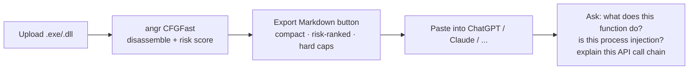
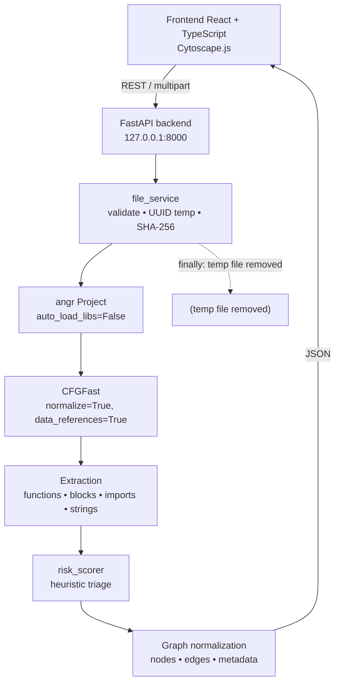
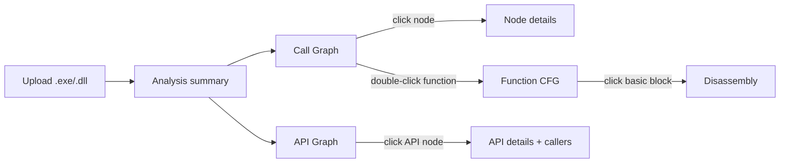

# Binary Graph Analyzer

[🇻🇳 Tiếng Việt (primary document)](README.md) · 🇬🇧 English · [Security policy](SECURITY.md)

A **static + dynamic analysis** tool for PE files (`.exe` / `.dll`) that runs entirely locally,
turning disassembly into an interactive, neural-network-style graph — and into a compact
Markdown report **built to be pasted straight into ChatGPT/Claude**, instead of forcing you to
hand-copy thousands of lines of disassembly.

### 🤖 Why this pairs well with AI-assisted PE analysis

Handing an AI the raw `.exe` doesn't work — it can't execute a binary, and it can't disassemble
one either. Pasting a raw angr/IDA/Ghidra dump into a chat doesn't work well either — a
mid-sized binary can have thousands of functions, blowing past any context window instantly, and
the AI ends up guessing which unordered blob of JSON matters.

This tool sits in between:



- **Risk score ranks functions up front** so the AI isn't guessing which of thousands of
  functions to look at first.
- **Every table has a hard cap** (risk rows, edges, functions with pseudocode) — nothing gets
  silently truncated; whatever is cut is reported with an exact count.
- **The exported report is in English**, even though the rest of the app is Vietnamese — it
  tokenizes far more efficiently for most models than the raw JSON dump would.
- **No API key, no AI call happens inside the app.** This isn't a hidden "AI integration" that
  phones out on your behalf — it only prepares clean data; you paste it into whichever AI tool
  you choose, yourself. Nothing leaves your machine except the exact text you copy.
- The full graph/CFG/pseudocode is still browsable directly in the UI — the Markdown export is a
  shortcut for AI, not a replacement for looking at the data yourself.

Export format details: [section 8](#markdown-export-format).

> **Safety:** this tool **never executes** the sample. Binaries are only ever read as data and
> disassembled by angr. No sandbox, no emulator, no file/hash sent to the Internet. The backend
> (`backend/app/`) never uses `subprocess` — a unit test enforces this as a regression guard. The
> desktop build ([section 13](#13-desktop-build-no-install-required)) is the one exception: it uses
> `subprocess` in exactly one place, in a launcher *outside* `backend/app/`, and only to start its
> own bundled Python — it never touches the sample file. The Debug feature
> ([section 15](#15-debug-dynamic-analysis)) is a separate, explicit exception — see the note there.

---

## 1. Project description

Upload a PE file; the backend uses [angr](https://angr.io)'s `CFGFast` to recover control flow,
then normalizes every result into a single graph schema. The frontend renders it with Cytoscape.js
in three views:

| View | Content |
|---|---|
| **Call Graph** | Function → Function, plus API nodes for called imports |
| **Function CFG** | Basic blocks of one function, with per-block disassembly |
| **API Graph** | Function → Imported API (bipartite, one node per API) |

Besides the graph, the tool extracts: entry point, function list, imported APIs (with DLL),
strings, and a **heuristic risk score** to help prioritise analysis. Need to go deeper than static
analysis? Open a **real debug session** (breakpoints, stepping, read/edit registers, live
assembly) — see [section 15](#15-debug-dynamic-analysis).

> The risk score is a heuristic to prioritise analysis, **not a malware detection verdict**.

---

## 2. Architecture



UI data flow:



Layout:

```text
┌─────────────────────────────────────────────────────────────┐
│ Upload | Graph type | Layout | Search | Fit/Reset/Labels     │
├──────────────┬──────────────────────────────┬───────────────┤
│ Summary      │                              │ Node details  │
│ + Filters    │        Graph canvas          │               │
│ + Functions  │        (Cytoscape.js)        │               │
├──────────────┴──────────────────────────────┴───────────────┤
│ Legend and analysis status                                  │
└─────────────────────────────────────────────────────────────┘
```

### Directory structure

```text
binary-graph-analyzer/
├── backend/
│   ├── app/
│   │   ├── main.py                    FastAPI app + error envelope
│   │   ├── config.py                  Settings (env prefix BGA_)
│   │   ├── dependencies.py            DI wiring
│   │   ├── api/
│   │   │   ├── analysis.py            Analysis endpoints
│   │   │   └── health.py              Health check
│   │   ├── analyzers/
│   │   │   ├── angr_analyzer.py       angr driver → dataclasses
│   │   │   ├── call_graph_builder.py  Call graph + API graph
│   │   │   ├── cfg_builder.py         One function's CFG
│   │   │   ├── import_extractor.py    Import table (pefile → CLE)
│   │   │   ├── string_extractor.py    Whole-file + per-function strings
│   │   │   └── risk_scorer.py         Heuristic triage
│   │   ├── models/
│   │   │   ├── graph.py               Normalised graph schema
│   │   │   └── analysis.py            Response models
│   │   ├── repositories/              Interface + in-memory store
│   │   ├── services/
│   │   │   ├── analysis_service.py    Orchestration
│   │   │   └── file_service.py        Upload + cleanup
│   │   └── utils/
│   │       ├── address.py             Address normalisation, node ids
│   │       └── security.py            Validation, hashing, temp files
│   ├── tests/                         300 tests
│   └── requirements.txt
├── frontend/
│   ├── src/
│   │   ├── components/                UI components
│   │   ├── services/analysisApi.ts    REST client
│   │   ├── types/graph.ts             Wire types
│   │   ├── hooks/useGraphFilters.ts   Filter state + predicate
│   │   ├── styles/                    CSS variables (light/dark)
│   │   ├── App.tsx
│   │   └── main.tsx
│   └── package.json
├── desktop/                            Standalone desktop packaging (section 13)
│   ├── launcher_stub.py               Native launcher (PyInstaller-packaged)
│   ├── requirements.txt               Dependencies for the embeddable Python
│   └── README.md
├── scripts/
│   ├── run_backend.bat
│   ├── run_frontend.bat
│   ├── run_all.ps1
│   └── build_desktop_app.ps1          Build the desktop app (section 13)
└── README.md
```

---

## 3. Environment requirements

| Component | Required | Verified on |
|---|---|---|
| Python | 3.11+ | CPython **3.14.4** (Windows x64) |
| Node.js | 18+ | **24.18.0** |
| npm | 9+ | **11.16.0** |
| OS | Windows / Linux / macOS | Windows 11 Pro |

angr `9.3.2` installs fine on Python 3.14 x64. Some dependencies (`mulpyplexer`) only ship a
pure-Python sdist, so **do not** use `pip install --only-binary=:all:` — it will fail.

On startup, angr may print `failed loading "unicornlib.dll", unicorn support disabled`. This
warning is **harmless**: unicorn is only needed for emulation, which this tool never performs.

---

## 4. Backend setup

```bash
cd backend
python -m venv .venv
.venv\Scripts\activate
pip install -r requirements.txt
```

## 5. Frontend setup

```bash
cd frontend
npm install
copy .env.example .env
```

`.env` only holds the backend URL:

```text
VITE_API_BASE_URL=http://127.0.0.1:8000
```

---

## 6. Running it

### Run both (recommended, Windows)

```bash
powershell -ExecutionPolicy Bypass -File scripts\run_all.ps1
```

The script creates a venv, installs dependencies, starts both servers, and opens the browser.
Use `-SkipInstall` to skip the install step once dependencies are already there.

### Run separately

Backend:

```bash
cd backend
.venv\Scripts\activate
uvicorn app.main:app --host 127.0.0.1 --port 8000
```

Frontend:

```bash
cd frontend
npm run dev
```

Open <http://127.0.0.1:5173>. API docs at <http://127.0.0.1:8000/docs>.

---

## 7. Usage

1. Click **Upload .exe / .dll** and pick a benign PE file.
2. Wait for analysis (a few seconds to tens of seconds depending on size). The status bar shows
   progress.
3. The **Call Graph** appears. Interactions:

| Action | Result |
|---|---|
| Click a node | Show details in the right panel, highlight direct neighbours |
| **Double-click** a function node | Open that function's **CFG** |
| Right-click a node | Hide the node |
| **Shift** + right-click a node | Expand one more hop |
| Drag / scroll | Pan / zoom |
| Hover | Summary tooltip |

4. Left panel: search functions, view the summary, and adjust filters. Click a function to focus
   its node; **double-click** to open its CFG.
5. Right panel: details for the function / basic block / API of whichever node is selected. For
   functions, **Disassembly** and **Pseudocode** render as two separate boxes, always visible side
   by side (not a toggle) — pseudocode is C-like code generated by `angr.analyses.Decompiler`
   (heuristic, not guaranteed 100% correct), pre-computed only for a priority subset of functions
   (entry point, named functions, high risk score) since decompiling is far more expensive than
   disassembly — see "Current limitations". For the rest, click **"Decompile this function"** to
   generate pseudocode on demand (best-effort, reusing the angr analysis already held in memory —
   no need to re-analyse from scratch).
   **Disassembly <-> Pseudocode sync** (IDA-style): a row/line with a blue left rail has a two-way
   mapping - **hover it** (no click needed) to instantly highlight the matching spot in the other
   box, auto-scrolling it into view if it's currently off-screen. Built on angr's decompiler's own
   internal `map_addr_to_pos`, so not every line has a mapping (variable declarations, bare braces
   have no machine address).
6. **Right-click to copy**: register values, addresses (disassembly/pseudocode/function
   list/debug panel), function names, block labels, instruction lines, pseudocode lines - right-click
   the value you want, pick the matching item from the menu.
7. **Layout**: *Neural Network* (force-directed, default for the call graph) or *Hierarchical Flow*
   (default for the CFG).
8. **Export Markdown**: a toolbar button that downloads a compact `.md` report — file summary, a
   function table sorted by risk score, imports grouped by capability, the call graph as an
   edge-list, and pseudocode/risk reasons for notable functions. Designed to be pasted straight
   into an AI chat or sent to a colleague without this tool installed; it is not a raw data dump —
   see section 8.
9. **Export all (decompile everything)**: the button next to it — actively decompiles every
   function still missing pseudocode (no cap, unlike the bounded automatic pass at analysis time),
   then downloads a separate `.md` report listing pseudocode for **every** decompiled function, not
   just the top 25 by risk. Since decompiling one function can take tens of seconds, this can take
   several minutes on a binary with many functions — the button disables itself and changes its
   label while running. Useful when you want a complete dump (to read manually, archive, or feed
   into another tool) rather than a compact report meant for pasting into an AI — see section 8.
10. **Export Markdown for this function**: a button in the details panel (when a function is
    selected) — downloads a `.md` report for **exactly one** function, with full disassembly and
    pseudocode (if available), not risk-filtered since there is only one function anyway. Does not
    decompile anything itself - a function without pseudocode yet just reports why in the file.
    Much smaller than `/export.md`, useful when you want to ask an AI about one specific function
    rather than the whole binary — see section 8.

### Filters

Filters **never delete the underlying data** — they only change what is currently displayed:

- Minimum risk score
- Depth from the entry point (server-side, 1–5 hops) and a client-side hop cap
- Max node count (100 / 250 / 500 / 1000 / 2000)
- Hide imported APIs
- Hide unnamed functions (`sub_xxxx`)
- Only functions with strings
- Only functions calling a specific API
- Search by function name / API name / address / module

---

## 8. API endpoints

| Method | Path | Description |
|---|---|---|
| `GET` | `/api/health` | Health check + angr status |
| `POST` | `/api/analysis` | Upload (`multipart/form-data`, field `file`) and analyse |
| `GET` | `/api/analysis/{id}` | Fetch a stored analysis result |
| `GET` | `/api/analysis/{id}/functions` | Function list — `search`, `limit`, `offset`, `minRiskScore` |
| `GET` | `/api/analysis/{id}/functions/{addr}` | One function's details |
| `GET` | `/api/analysis/{id}/functions/{addr}/cfg` | Function CFG (lazy, with instructions) |
| `POST` | `/api/analysis/{id}/functions/{addr}/decompile` | On-demand decompile (angr), no-op if already done |
| `GET` | `/api/analysis/{id}/functions/{addr}/export.md` | Markdown report for one function (see section 7, step 10) |
| `POST` | `/api/analysis/{id}/decompile-all` | Decompile every remaining function, no cap (can take minutes) |
| `GET` | `/api/analysis/{id}/call-graph` | Call graph — `depth` (1–5), `maxNodes`, `includeApis` |
| `GET` | `/api/analysis/{id}/api-graph` | API graph — `maxNodes`, `capability` |
| `GET` | `/api/analysis/{id}/imports` | Imported APIs with DLL and callers |
| `GET` | `/api/analysis/{id}/strings` | Strings — `limit`, `search` |
| `GET` | `/api/analysis/{id}/expand/{addr}` | One-hop neighbourhood of a function |
| `GET` | `/api/analysis/{id}/export.md` | Compact Markdown report (see section 7, step 7) |
| `GET` | `/api/analysis/{id}/export-full.md` | Same, but pseudocode for **every** function (see section 7, step 8) |
| `DELETE` | `/api/analysis/{id}` | Delete a result from memory |

Addresses in URLs accept both `0x401000` and `401000`.

### Markdown export format

`/export.md` returns `text/markdown` (with `Content-Disposition: attachment`) — purpose-built for
pasting into an AI chat or sending to someone without this tool, **not** a full JSON dump:

- A risk-score table instead of nested JSON arrays — one row per function with risk > 0, plus the
  reasons.
- Imports grouped by DLL **and** by capability (`process_injection`, `anti_analysis`, ...).
- The call graph as a compact edge-list (`caller -> callee [CALL]`) instead of full node/edge
  objects.
- Pseudocode/risk reasons shown in full only for: the entry point, functions with risk > 0, and
  functions that already have pseudocode — everything else is a single table row, not a dump of
  all 600+ functions in the binary.
- The document itself is **in English** even though the rest of the app is in Vietnamese — English
  tokenises more compactly for most AI models, which is this format's whole point.
- Hard caps everywhere (risk-table rows, edges, functions with pseudocode) — anything truncated is
  always reported with a count, never silently dropped.

`/export-full.md` shares the same header/risk table/imports/call graph, but its pseudocode section
lists **every** function that currently has it (no 25-function cap, no risk filter) — a function
that isn't decompiled (yet, or at all) is listed in a compact table at the end with the reason,
instead of being dropped. It does not decompile anything itself — call `/decompile-all` first to
get as much pseudocode as possible. Can produce a much larger file than `/export.md` for a binary
with many non-trivial functions - that is the intent, not a bug to fix; this variant's goal is
completeness, not staying small enough for an AI chat.

### Graph schema

Every graph endpoint returns the same shape:

```json
{
  "nodes": [
    {
      "id": "func_401000",
      "label": "main",
      "kind": "function",
      "address": "0x401000",
      "metadata": {
        "size": 256, "blockCount": 8, "callerCount": 2, "calleeCount": 5,
        "riskScore": 12, "riskLevel": "medium",
        "isImported": false, "isEntryPoint": true
      }
    }
  ],
  "edges": [
    {
      "id": "edge_1",
      "source": "func_401000",
      "target": "api_kernel32!CreateFileW",
      "kind": "CALL",
      "metadata": { "callSite": "0x401050", "callCount": 1 }
    }
  ],
  "metadata": { "graphType": "call_graph", "depth": 2, "truncated": false }
}
```

Node kinds: `function`, `basic_block`, `api`, `string`, `module`, `behavior`.
Edge kinds: `CALL`, `JUMP`, `TRUE`, `FALSE`, `FALLTHROUGH`, `RETURN`, `REFERENCE`, `READ`, `WRITE`, `DATA_FLOW`.

### Errors

Every error returns the same envelope. In production mode (`BGA_ENVIRONMENT=production`), the
`details` field is stripped so internals are never leaked:

```json
{ "error": { "code": "ANALYSIS_FAILED", "message": "Could not analyse the binary", "details": null } }
```

Error codes: `INVALID_EXTENSION`, `EMPTY_FILE`, `FILE_TOO_LARGE`, `NOT_A_PE`, `LOAD_FAILED`,
`CFG_FAILED`, `NO_FUNCTIONS`, `ANALYSIS_TIMEOUT`, `ANALYSIS_NOT_FOUND`, `FUNCTION_NOT_FOUND`,
`VALIDATION_ERROR`, `INTERNAL_ERROR`.

### Configuration

Every setting can be overridden via `BGA_`-prefixed environment variables:

| Variable | Default | Meaning |
|---|---|---|
| `BGA_HOST` | `127.0.0.1` | Bind address |
| `BGA_PORT` | `8000` | Port |
| `BGA_ENVIRONMENT` | `development` | `production` hides `details` in errors |
| `BGA_MAX_UPLOAD_MB` | `100` | Upload size cap |
| `BGA_ANALYSIS_TIMEOUT_SECONDS` | `300` | Per-analysis timeout |
| `BGA_MAX_STORED_ANALYSES` | `16` | Results kept in RAM (LRU) |
| `BGA_CORS_ORIGINS` | localhost:5173/4173 | Allowed origins |

---

## 9. Current limitations

- **No database yet.** Results live in RAM, capped at 16 analyses (LRU), lost on backend restart.
  The `AnalysisRepository` interface is already split out to swap in SQLite later.
- **The call graph only shows what is reachable from the entry point.** At the maximum depth of 5,
  functions `CFGFast` cannot connect to the entry point (fairly common) do not appear on the
  graph — but they **are still listed in full in the Functions panel**, clickable for full detail.
  The UI shows a banner with the count of omitted functions.
- **A timeout does not actually cancel angr.** angr has no cancellation support; when a request
  times out it returns `ANALYSIS_TIMEOUT`, but the background thread keeps running to completion.
- **All disassembly is extracted at analysis time** (so the temp file can be deleted immediately),
  capped at 4000 functions, 512 blocks/function, 256 instructions/block. The first response still
  carries no instructions — a CFG is only returned when a function is opened.
- **Automatic pseudocode is capped at 60 functions per analysis, but more can be generated on
  demand.** Decompiling (`angr.analyses.Decompiler`) is far more expensive than disassembly — a
  ~330-block function measured ~19s versus ~0.1s to just disassemble. Right after analysis
  finishes, the tool auto-decompiles up to 60 priority functions (entry point → named functions →
  high risk score → fewer blocks first), stopping early past a 45s budget. Functions outside that
  set show a **"Decompile this function"** button to trigger decompilation on demand, reusing the
  `angr.Project` kept alive in memory for each cached analysis (verified: decompiling still works
  on Windows after the original temp file has been deleted). Pseudocode is always angr's heuristic
  output, not guaranteed to match the original source exactly.
- **A Ghidra decompiler integration (higher quality than angr's) was attempted but did not work on
  the current dev machine** — `pyghidra` 3.1.0 (bundled with Ghidra 12.1.2 PUBLIC) hits an infinite
  recursion bug on JVM startup (reproduced on both Python 3.12 and 3.14, so not a Python-version
  issue), and Ghidra 12.x dropped Jython, leaving PyGhidra as the only way to run a `.py` script at
  all. It may work on a different machine or Ghidra build; check the development history for
  exactly what was tried if you want to retry it.
- **No data-flow yet.** The schema already supports `DATA_FLOW` / `READ` / `WRITE`, but no analyzer
  produces them.
- **Packed binaries** yield poor results. The tool detects packing heuristically and shows a
  warning, but does not unpack.
- **String-to-function mapping** depends on angr's `data_references`; many functions will show no
  strings even when the binary clearly has them.
- PE only. ELF/Mach-O are rejected at the validation step.

---

## 10. Safety notes

These constraints are enforced in code, not just convention:

1. **Never executes the binary.** No `subprocess`, `os.system`, `os.spawn`, Wine, sandbox, or
   emulator. A unit test (`test_sample_is_never_executed`) scans all of `app/` to catch
   regressions.
   **Deliberate exception:** the Debug feature's "Run directly on this machine" mode
   (`app/dynamic/`, see section 15) **does** execute the specified file directly on the machine
   running the app — this is behaviour the user explicitly requested and confirmed the risk of
   (see `docs/dynamic-analysis-spec.md`'s "local-launch" addendum), completely separate from the
   static analyzer (sections 1–14 still hold the "never executes" invariant absolutely, unaffected
   by this). Do not use this mode on an unidentified/suspicious sample — the remote + isolated-VM
   mode (section 15) is the right choice for that.
2. **Only reads files as data.** angr loads with `auto_load_libs=False` and only disassembles.
3. **Sends nothing externally.** No VirusTotal, no telemetry, no hash lookups.
4. **Blocks path traversal.** The user's filename is never used to build a path — the temp file is
   always `<tempdir>/<uuid>.exe`. The original name is only sanitised for display.
5. **Enforces the size cap while streaming**, not after reading everything into memory first.
6. **Deletes the temp file in a `finally`** — on success, on error, and on cancellation alike.
7. **Binds to loopback by default** (`127.0.0.1`); CORS only allows the local frontend.
8. **Never logs binary contents.** Logs only carry the display name, size, and the first 16
   characters of the SHA-256.
9. **Never shows raw bytes** on the frontend — only already-disassembled mnemonics/operands.
10. **Never auto-analyses anything** on startup.

**Still analyse real samples inside an isolated VM.** This tool never executes the sample, but its
parsing libraries (angr, pefile) can still have vulnerabilities when handed a file deliberately
crafted to attack the parser itself.

---

## 11. Tests

```bash
cd backend
.venv\Scripts\activate
pytest tests -v
```

300 tests, covering: extension/size validation, SHA-256, address normalisation, path-traversal
protection, risk scoring, call-graph-to-JSON conversion, duplicate-edge removal, depth limiting,
max-node limiting, decompile-priority ordering, the error envelope, the dynamic analysis module
(section 15, tested via `FakeDebugBridge` as well as a real `Win32DebugBridge` against live
processes), and one integration test that runs angr for real.

A benign C test fixture lives at
[`backend/tests/fixtures/sample.c`](backend/tests/fixtures/sample.c). Compile it with MinGW-w64 or
Visual Studio:

```bash
gcc -O0 -o backend/tests/fixtures/sample.exe backend/tests/fixtures/sample.c
```

```bash
cl /Od /Fe:sample.exe sample.c
```

If it cannot be compiled, the integration test falls back to a benign system binary
(`C:\Windows\System32\where.exe`) in read-only mode, or skips itself on other platforms. Point it
at a different file with `BGA_TEST_PE`:

```bash
set BGA_TEST_PE=C:\path\to\sample.exe
pytest tests/test_integration_angr.py -v
```

Frontend:

```bash
cd frontend
npm run build
```

---

## 13. Desktop build (no install required)

Besides running as a web app (backend + browser), the project also packages into **a standalone
Windows program**: copy one folder to another machine, double-click the `.exe`, and it just
runs — no Python, Node.js, pip, or npm needed on the target machine, and no internet needed at
runtime.

```powershell
cd scripts
powershell -ExecutionPolicy Bypass -File build_desktop_app.ps1
```

The output lands in `dist_desktop\BinaryGraphAnalyzer\` (~600 MB, mostly angr's precompiled
dependencies — z3-solver, capstone, pyvex). Copy the whole folder to another Windows 10/11 x64
machine and run `BinaryGraphAnalyzer.exe` — it opens a native window (WebView2) showing the same
UI as the web app.

> **Requires the Microsoft Edge WebView2 Runtime on the target machine.** Most full Windows
> 10/11 installs already have it, but some minimal machines/VMs (a number of Windows 10 22H2 test
> images among them) don't. Without it, pywebview *silently* falls back to the legacy MSHTML/IE
> engine (the log line `MSHTML is deprecated` is that fallback happening) — which cannot run this
> app at all: Vite emits `<script type="module">`, and MSHTML has never supported ES modules, so
> the window opens blank/broken. `desktop_launcher.py` checks the registry before opening the
> window and fails with a clear message and a download link instead of letting MSHTML silently
> take over. Get the Evergreen Bootstrapper (needs internet to install, ~2 MB) at:
> https://go.microsoft.com/fwlink/p/?LinkId=2124703

> **No HTTP backend anymore.** An earlier version ran an internal FastAPI/uvicorn server on a
> random loopback port, with the frontend calling it via `fetch()`. The current version drops that
> layer entirely: every analysis operation (upload, call graph, CFG, decompile, export) goes
> through pywebview's `js_api` bridge (`window.pywebview.api.*`) — a same-process Python function
> call, no socket, no port opened for the API at all. The only server left is the small static file
> server built into pywebview (`http_server=True`), used only to serve the already-built frontend
> files (required because Chromium blocks `<script type="module">` — what Vite outputs — from
> running directly over `file://`); it has no `/api/*` routes and never touches the sample file.
> See the diagram in [`desktop/README.md`](desktop/README.md#architecture) for the full call flow.

**Architecture:** `BinaryGraphAnalyzer.exe` (a PyInstaller-packaged ~30-line launcher, which does
**not** bundle angr) starts an "embeddable" Python distribution carrying all dependencies
(`python_embed/`, installed via a normal `pip install`, not frozen) to run
`desktop_launcher.py` — which opens a pywebview window with `js_api=DesktopApi()`
(`backend/app/desktop_bridge.py`), calling straight into the same `AnalysisService` the web build
uses. Why angr is not bundled directly with PyInstaller: angr's plugin/SimProcedure system does a
lot of dynamic, introspection-style importing that PyInstaller cannot statically discover — the
classic "works from source, breaks when frozen" failure mode of angr-based tools. Verified
concretely during development: capstone and claripy/z3 (the two heaviest compiled dependencies)
run correctly from the embeddable build, and a full `CFGFast` analysis on a real PE runs
successfully end to end through the packaged bundle.

Full details (architecture, two embeddable-Python-specific bugs hit during the build, current
limitations): see [`desktop/README.md`](desktop/README.md).

---

## 14. Roadmap

1. **SQLite persistence** — replace `InMemoryAnalysisRepository`, keep results across restarts.
2. **Asynchronous analysis** — return `analysisId` immediately, push real progress via
   SSE/WebSocket instead of the frontend guessing the stage.
3. **Run angr in a separate process** so a timeout can actually cancel the work.
4. **Data-flow edges** — the schema already has `DATA_FLOW`/`READ`/`WRITE`; needs an analyzer
   (angr `VSA`/`DDG`).
5. **Behaviour clustering** — group functions by capability into `behavior` nodes.
6. **Diff two binaries** — diff call graphs to triage variants.
7. **Improve the call graph** — use `CFGEmulated` or an indirect-jump resolver to connect currently
   orphaned functions.
8. **Export** — save the graph as GraphML/DOT/PNG.
9. **Specific packer identification** (UPX, Themida, VMProtect) instead of the current generic
   heuristic.
10. **Virtualisation for very large graphs** — node count is already capped; level-of-detail
    rendering could go further.

---

## 15. Debug (dynamic analysis)

Beyond static analysis (sections 1–14, where the sample is **never executed**), there is a
completely separate module: the **Debug** button on the toolbar opens a **real** debug session
(breakpoints, stepping, live/editable registers, live stack reads) by **executing the specified
file itself, directly on the machine running the app** — no VM, no isolation. By default it runs
**the exact file you just uploaded** (one click — the app re-sends and keeps its own separate
copy, since the original was already deleted right after static analysis finished); a path to a
different file can also be typed in manually.

**Only use this for software you fully trust** (e.g. this app itself during development), **never
for an unidentified sample** — this is an explicit, documented exception to the "never executes
the binary" rule in section 10; isolating via a VM is the user's own responsibility, the app does
not do it automatically. See the note in section 10 and the "local-launch" addendum in
`docs/dynamic-analysis-spec.md` for the full rationale and limits.

Architecture: `backend/app/dynamic/debug_bridge/win32_debug.py` talks straight to the Windows
Win32 debug API via `ctypes` (`CreateProcess` + `DEBUG_PROCESS`, `WaitForDebugEvent`/
`ContinueDebugEvent`, self-managed software `INT3` breakpoints) — the same technique x64dbg/
OllyDbg use, no dependency on `dbgeng.dll`/`pykd`. Every call is pinned to one dedicated
background thread (`ThreadPinnedDebugBridge`), since the Win32 debug API is thread-affine. When
the debugger stops at a runtime address, the app recomputes the corresponding static address
(compensating for ASLR/rebase) and highlights the matching node on the already-rendered static
graph.

Full spec/safety constraints: [`docs/dynamic-analysis-spec.md`](docs/dynamic-analysis-spec.md).

**Current capabilities:**

- **Assembly View**: while a debug session is active, the main panel switches from the graph to a
  linear assembly listing of the currently-running function, auto-highlighting and auto-scrolling
  to the executing line on every step. If the PC is in a system module (outside the static
  analyzer's coverage, e.g. `ntdll`/`kernel32`), it disassembles live from the running process
  instead of using static data — breakpoints work in both cases (a static address inside the
  analysed module, or a runtime address outside it).
- **Ctrl+G "go to address"** (x64dbg-style) in Assembly View, three tiers: (1) a row already on
  screen; (2) not shown yet but a static function contains that address - fetches its CFG and
  switches the view to it; (3) no static function covers it either, but a debug session is open -
  live-disassembles directly at that address if it falls inside any *currently loaded* module
  (including a system one like `ntdll`, and it doesn't need to be where the PC currently is)
  before finally giving up with an error.
- **Modules** (x64dbg-style): every module currently mapped in the debuggee - the main EXE and
  each DLL loaded, including ones loaded well after attach - base address + file path, refreshed
  after every step/continue.
- **Registers & flags**: read and **edit** register values (x86 and x64) and individual EFLAGS bits
  (CF/ZF/SF/OF/PF/AF/TF/IF/DF) — after editing, the next Step Into/Step Over uses the edited value
  immediately.
- **Memory dump**: view raw bytes at any runtime address (classic address/hex/ASCII layout), not
  limited to the analysed module.
- **Display address rebasing**: while a debug session is active, every address shown in the UI
  (Function List, graphs, CFG, Assembly View) is automatically offset to match the real runtime
  address (ASLR-compensated) — the underlying data used for API calls/breakpoints still uses the
  static coordinate space unchanged. Markdown export while debugging also shows real runtime
  addresses, not static ones.
- **"Pending" breakpoints**: a breakpoint set on an address inside a module that hasn't loaded yet
  (a DLL to be `LoadLibrary`'d later) is still recorded, shown with a ⏳ mark in the Breakpoints
  list - automatically (re-)planted on every Continue until that module loads, no extra action
  needed. When a module unloads (`FreeLibrary`), any breakpoint planted inside its address range
  is cleaned up automatically so it can't misfire into whatever unrelated module the OS happens to
  map over that same freed range next.
- **`exited` status**: when the debuggee terminates on its own (ran to completion, or crashed),
  status switches to a dedicated `EXITED` state instead of looking like an ordinary breakpoint -
  Step/Continue disable themselves, with a clear message. (Previously every kind of stop reported
  `BREAK` the same way, including a dead process - the debugger looked permanently frozen at some
  address forever, with no error shown anywhere.)

**Not yet available / still limited:** writing arbitrary memory (`write_memory` exists at the
bridge layer but has no API/UI yet), attaching by `processName` instead of always launching fresh,
stepping across more than one thread at once (only the current thread is followed), pending
breakpoints only re-arm on Continue (not yet on Step Into/Step Over).

A mandatory warning modal shows before any debug session opens (once per page session), making
clear this is real execution on the current machine, not a sandbox.

---

## Language

This is the English translation. Primary document (Vietnamese): [`README.md`](README.md).
Security policy: [`SECURITY.md`](SECURITY.md).
