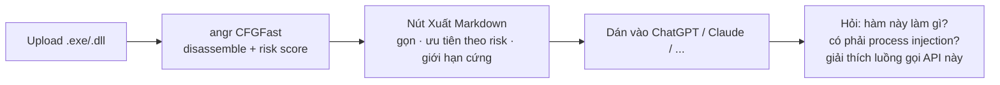
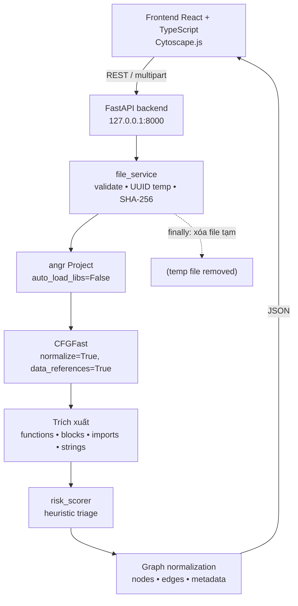
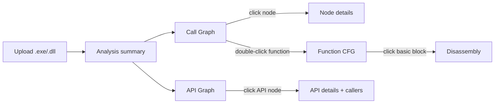

# Binary Graph Analyzer

🇻🇳 Tiếng Việt (tài liệu chính) · [🇬🇧 English](README.en.md) · [Security policy](SECURITY.md)

Công cụ **phân tích tĩnh + động** file PE (`.exe` / `.dll`) chạy hoàn toàn local, biến kết quả
disassembly thành đồ thị tương tác giống mạng nơ-ron — và thành một báo cáo Markdown gọn, **sinh
ra để dán thẳng vào ChatGPT/Claude**, thay vì bắt bạn tự tay chép hàng nghìn dòng disassembly.

### 🤖 Vì sao hợp để phân tích PE *cùng với* AI

Đưa nguyên file `.exe` cho AI đọc thì vô nghĩa — AI không thực thi được binary, cũng không tự
disassemble được. Dán nguyên dump của angr/IDA/Ghidra vào chat cũng không xong — một binary tầm
trung có thể ra tới hàng nghìn function, vượt context window ngay lập tức, và AI phải "mò" trong
một đống JSON lồng nhau không theo thứ tự ưu tiên nào.

Công cụ này đứng ở giữa hai việc đó:



- **Risk score xếp hạng trước, AI không phải tự đoán nên đọc hàm nào trước** trong hàng nghìn hàm.
- **Giới hạn cứng ở mọi bảng** (số hàng risk, số edge, số function có pseudocode) — không có
  chuyện AI bị cắt giữa chừng một cách âm thầm; phần bị bỏ luôn ghi rõ số lượng.
- **Tài liệu xuất ra bằng tiếng Anh** dù giao diện dùng tiếng Việt — tokenize gọn hơn cho hầu hết
  model, đỡ tốn context hơn hẳn dump JSON gốc.
- **Không có API key hay lời gọi AI nào từ bên trong app.** Đây không phải "tích hợp AI" giấu một
  cuộc gọi ra ngoài — app chỉ chuẩn bị dữ liệu sạch, bạn tự dán tay vào công cụ AI mình chọn. File
  mẫu và kết quả phân tích không rời khỏi máy trừ đúng đoạn bạn copy.
- Vẫn xem được toàn bộ đồ thị/CFG/pseudocode trực quan trên UI — báo cáo Markdown là một lối tắt
  cho AI, không thay thế phần xem trực tiếp.

Chi tiết định dạng export: [mục 8](#định-dạng-export-markdown).

> **An toàn:** công cụ này **không bao giờ thực thi** file mẫu. Binary chỉ được đọc như dữ liệu
> và disassembly bằng angr. Không sandbox, không emulator, không gửi file hay hash ra Internet.
> Backend (`backend/app/`) không dùng `subprocess` — có unit test khóa cứng điều này. Riêng bản
> desktop ([mục 13](#13-bản-desktop-không-cần-cài-gì)) dùng `subprocess` đúng một chỗ, ở launcher
> *ngoài* `backend/app/`, và chỉ để khởi động chính Python đóng gói sẵn của nó — không bao giờ
> chạm tới file mẫu. Chế độ Debug ([mục 15](#15-debug-dynamic-analysis)) là ngoại lệ tường minh,
> tách riêng, xem ghi chú ở mục đó.

---

## 1. Mô tả dự án

Upload một file PE, backend dùng [angr](https://angr.io) `CFGFast` để khôi phục control flow,
rồi chuẩn hóa mọi kết quả về một schema graph duy nhất. Frontend render bằng Cytoscape.js với
ba chế độ xem:

| Chế độ | Nội dung |
|---|---|
| **Call Graph** | Function → Function, kèm node API cho các import được gọi |
| **Function CFG** | Basic block của một function, kèm disassembly từng block |
| **API Graph** | Function → Imported API (bipartite, mỗi API đúng một node) |

Ngoài graph, công cụ trích xuất: entry point, danh sách function, imported API (kèm DLL),
strings, và một **risk score heuristic** để ưu tiên phân tích. Cần đi sâu hơn phân tích tĩnh có
thể mở thêm một phiên **debug thật** (breakpoint, step, đọc/sửa register, xem assembly sống) —
xem [mục 15](#15-debug-dynamic-analysis).

> Risk score là điểm heuristic để ưu tiên phân tích, **không phải kết luận phát hiện mã độc**.

---

## 2. Kiến trúc



Luồng dữ liệu trong UI:



Bố cục giao diện:

```text
┌─────────────────────────────────────────────────────────────┐
│ Upload | Graph type | Layout | Search | Fit/Reset/Labels     │
├──────────────┬──────────────────────────────┬───────────────┤
│ Summary      │                              │ Node details  │
│ + Filters    │        Graph canvas          │               │
│ + Functions  │        (Cytoscape.js)        │               │
├──────────────┴──────────────────────────────┴───────────────┤
│ Legend và trạng thái phân tích                              │
└─────────────────────────────────────────────────────────────┘
```

### Cấu trúc thư mục

```text
binary-graph-analyzer/
├── backend/
│   ├── app/
│   │   ├── main.py                    FastAPI app + error envelope
│   │   ├── config.py                  Settings (env prefix BGA_)
│   │   ├── dependencies.py            DI wiring
│   │   ├── api/
│   │   │   ├── analysis.py            Endpoint phân tích
│   │   │   └── health.py              Health check
│   │   ├── analyzers/
│   │   │   ├── angr_analyzer.py       Driver angr → dataclasses
│   │   │   ├── call_graph_builder.py  Call graph + API graph
│   │   │   ├── cfg_builder.py         CFG của một function
│   │   │   ├── import_extractor.py    Import table (pefile → CLE)
│   │   │   ├── string_extractor.py    Strings toàn file + theo function
│   │   │   └── risk_scorer.py         Heuristic triage
│   │   ├── models/
│   │   │   ├── graph.py               Schema graph chuẩn hóa
│   │   │   └── analysis.py            Response models
│   │   ├── repositories/              Interface + in-memory store
│   │   ├── services/
│   │   │   ├── analysis_service.py    Orchestration
│   │   │   └── file_service.py        Upload + cleanup
│   │   └── utils/
│   │       ├── address.py             Chuẩn hóa địa chỉ, node id
│   │       └── security.py            Validate, hash, temp file
│   ├── tests/                         300 test
│   └── requirements.txt
├── frontend/
│   ├── src/
│   │   ├── components/                UI components
│   │   ├── services/analysisApi.ts    REST client
│   │   ├── types/graph.ts             Wire types
│   │   ├── hooks/useGraphFilters.ts   Filter state + predicate
│   │   ├── styles/                    CSS variables (light/dark)
│   │   ├── App.tsx
│   │   └── main.tsx
│   └── package.json
├── desktop/                            Đóng gói desktop độc lập (mục 13)
│   ├── launcher_stub.py               Native launcher (PyInstaller đóng gói)
│   ├── requirements.txt               Dependencies cho Python embeddable
│   └── README.md
├── scripts/
│   ├── run_backend.bat
│   ├── run_frontend.bat
│   ├── run_all.ps1
│   └── build_desktop_app.ps1          Build bản desktop (mục 13)
└── README.md
```

---

## 3. Điều kiện môi trường

| Thành phần | Yêu cầu | Đã kiểm chứng trên |
|---|---|---|
| Python | 3.11+ | CPython **3.14.4** (Windows x64) |
| Node.js | 18+ | **24.18.0** |
| npm | 9+ | **11.16.0** |
| OS | Windows / Linux / macOS | Windows 11 Pro |

angr `9.3.2` cài được trên Python 3.14 x64. Một vài dependency (`mulpyplexer`) chỉ có sdist
thuần Python, nên **không** dùng `pip install --only-binary=:all:` — lệnh sẽ thất bại.

Khi khởi động, angr có thể in cảnh báo `failed loading "unicornlib.dll", unicorn support disabled`.
Cảnh báo này **vô hại**: unicorn chỉ cần cho emulation, mà công cụ này không bao giờ emulate.

---

## 4. Cài đặt backend

```bash
cd backend
python -m venv .venv
.venv\Scripts\activate
pip install -r requirements.txt
```

## 5. Cài đặt frontend

```bash
cd frontend
npm install
copy .env.example .env
```

`.env` chỉ chứa URL backend:

```text
VITE_API_BASE_URL=http://127.0.0.1:8000
```

---

## 6. Cách chạy

### Chạy cả hai (khuyến nghị, Windows)

```bash
powershell -ExecutionPolicy Bypass -File scripts\run_all.ps1
```

Script tự tạo venv, cài dependency, khởi động cả hai server và mở trình duyệt.
Dùng `-SkipInstall` để bỏ qua bước cài đặt khi đã có sẵn.

### Chạy riêng

Backend:

```bash
cd backend
.venv\Scripts\activate
uvicorn app.main:app --host 127.0.0.1 --port 8000
```

Frontend:

```bash
cd frontend
npm run dev
```

Mở <http://127.0.0.1:5173>. API docs tại <http://127.0.0.1:8000/docs>.

---

## 7. Cách sử dụng

1. Bấm **Upload .exe / .dll** và chọn một file PE lành tính.
2. Chờ phân tích (vài giây tới vài chục giây tùy kích thước). Thanh trạng thái hiển thị tiến trình.
3. **Call Graph** hiện ra. Các thao tác:

| Thao tác | Kết quả |
|---|---|
| Click node | Xem chi tiết ở panel phải, highlight neighbor trực tiếp |
| **Double-click** node function | Mở **Function CFG** của function đó |
| Right-click node | Ẩn node |
| **Shift** + right-click node | Expand thêm một hop |
| Kéo / cuộn | Pan / zoom |
| Hover | Tooltip tóm tắt |

4. Panel trái: tìm kiếm function, xem summary, và chỉnh bộ lọc.
   Click một function để focus node; **double-click** để mở CFG.
5. Panel phải: chi tiết function / basic block / API tùy node đang chọn. Với function,
   **Disassembly** và **Pseudocode** hiện thành hai khung riêng, luôn hiện song song (không
   phải toggle) — pseudocode là mã C giả lập do `angr.analyses.Decompiler` tự sinh
   (heuristic, không đảm bảo đúng 100%), chỉ tính sẵn tự động cho một số function ưu tiên
   (entry point, function có tên, risk cao) vì decompile tốn thời gian hơn hẳn disassembly —
   xem "Giới hạn hiện tại". Với các function còn lại, bấm **"Decompile hàm này"** để tạo
   pseudocode riêng ngay lúc đó (best-effort, dùng lại chính phân tích angr đã có sẵn trong
   bộ nhớ, không cần phân tích lại từ đầu).
   **Sync Disassembly ↔ Pseudocode** (kiểu IDA): dòng nào có viền trái xanh là có ánh xạ hai
   chiều — **di chuột tới** (không cần click) sẽ tự highlight ngay dòng tương ứng ở khung
   kia, và tự cuộn tới nếu dòng đó đang ngoài tầm nhìn. Dựa trên `map_addr_to_pos` nội bộ của
   decompiler angr, nên không phải dòng nào cũng có ánh xạ (khai báo biến, dấu ngoặc không có
   địa chỉ máy).
6. **Chuột phải để copy**: giá trị thanh ghi, địa chỉ (disassembly/pseudocode/function
   list/debug panel), tên hàm, tên block, dòng lệnh, dòng pseudocode — chuột phải vào giá
   trị cần copy, chọn đúng mục trong menu hiện ra.
7. **Layout**: *Neural Network* (force-directed, mặc định cho call graph) hoặc
   *Hierarchical Flow* (mặc định cho CFG).
8. **Xuất Markdown**: nút ở toolbar tải về một báo cáo `.md` gọn — tóm tắt file, bảng function
   theo risk score, import theo capability, call graph dạng edge-list, và pseudocode/lý do risk
   cho các function đáng chú ý. Thiết kế để dán thẳng vào chat với AI hoặc gửi cho đồng nghiệp
   không cài tool này; không phải dump toàn bộ dữ liệu thô — xem mục 8.
9. **Xuất tất cả (decompile hết)**: nút cạnh bên — chủ động decompile mọi function còn thiếu
   pseudocode (không giới hạn số lượng như bước tự động lúc phân tích), rồi tải về một báo cáo
   `.md` khác liệt kê pseudocode của **mọi** function đã decompile được, không chỉ top 25 theo
   risk. Vì decompile từng function có thể tốn tới hàng chục giây, thao tác này có thể mất vài
   phút với binary nhiều function — nút tự vô hiệu hoá và đổi nhãn trong lúc chạy. Phù hợp khi
   cần một bản dump đầy đủ (đọc thủ công, lưu trữ, hoặc đưa vào một tool khác) hơn là một báo
   cáo gọn để dán vào AI — xem mục 8.

### Bộ lọc

Bộ lọc **không xóa dữ liệu gốc** — chỉ thay đổi phần tử đang hiển thị:

- Risk score tối thiểu
- Độ sâu từ entry point (server, 1–5 hop) và giới hạn hop phía client
- Số node tối đa (100 / 250 / 500 / 1000 / 2000)
- Ẩn imported API
- Ẩn function không có tên (`sub_xxxx`)
- Chỉ function có string
- Chỉ function gọi một API cụ thể
- Tìm theo function name / API name / address / module

---

## 8. API endpoints

| Method | Path | Mô tả |
|---|---|---|
| `GET` | `/api/health` | Health check + trạng thái angr |
| `POST` | `/api/analysis` | Upload (`multipart/form-data`, field `file`) và phân tích |
| `GET` | `/api/analysis/{id}` | Lấy lại kết quả phân tích |
| `GET` | `/api/analysis/{id}/functions` | Danh sách function — `search`, `limit`, `offset`, `minRiskScore` |
| `GET` | `/api/analysis/{id}/functions/{addr}` | Chi tiết một function |
| `GET` | `/api/analysis/{id}/functions/{addr}/cfg` | CFG của function (lazy, kèm instruction) |
| `POST` | `/api/analysis/{id}/functions/{addr}/decompile` | Decompile on-demand (angr), no-op nếu đã có sẵn |
| `POST` | `/api/analysis/{id}/decompile-all` | Decompile mọi function còn thiếu, không giới hạn (có thể mất vài phút) |
| `GET` | `/api/analysis/{id}/call-graph` | Call graph — `depth` (1–5), `maxNodes`, `includeApis` |
| `GET` | `/api/analysis/{id}/api-graph` | API graph — `maxNodes`, `capability` |
| `GET` | `/api/analysis/{id}/imports` | Imported API kèm DLL và callers |
| `GET` | `/api/analysis/{id}/strings` | Strings — `limit`, `search` |
| `GET` | `/api/analysis/{id}/expand/{addr}` | Neighborhood một hop của function |
| `GET` | `/api/analysis/{id}/export.md` | Báo cáo Markdown gọn (xem mục 7, bước 7) |
| `GET` | `/api/analysis/{id}/export-full.md` | Như trên, nhưng pseudocode của **mọi** function (xem mục 7, bước 8) |
| `DELETE` | `/api/analysis/{id}` | Xóa kết quả khỏi bộ nhớ |

Địa chỉ trong URL chấp nhận cả `0x401000` lẫn `401000`.

### Định dạng export Markdown

`/export.md` trả về `text/markdown` (kèm `Content-Disposition: attachment`) — thiết kế riêng cho
việc dán vào chat với AI hoặc gửi cho người không cài tool này, **không phải** một bản dump JSON
đầy đủ:

- Bảng risk score thay vì mảng JSON lồng nhau — mỗi hàm risk > 0 một dòng, kèm lý do.
- Import gộp theo DLL **và** theo capability (`process_injection`, `anti_analysis`, ...).
- Call graph dạng edge-list gọn (`caller -> callee [CALL]`) thay vì node/edge object đầy đủ.
- Pseudocode/lý do risk chỉ hiển thị đầy đủ cho: entry point, function risk > 0, và function đã
  có pseudocode sẵn — các function còn lại chỉ là một dòng trong bảng, không dump toàn bộ 600+
  function của binary.
- Tài liệu **bằng tiếng Anh** dù phần còn lại của app dùng tiếng Việt — English tokenize gọn hơn
  cho hầu hết model AI, và đây là mục tiêu chính của định dạng này.
- Có giới hạn cứng (số hàng bảng risk, số edge, số function có pseudocode) — phần bị cắt luôn ghi
  rõ số lượng bị bỏ qua, không im lặng biến mất.

`/export-full.md` dùng chung header/risk table/imports/call graph, nhưng phần pseudocode liệt kê
**mọi** function đang có sẵn (không giới hạn 25 hàm, không lọc theo risk) — function chưa/không
decompile được liệt kê gọn trong một bảng cuối kèm lý do, thay vì bị bỏ qua. Không tự decompile gì
cả — gọi `/decompile-all` trước để có nhiều pseudocode nhất có thể. Có thể ra file lớn hơn hẳn
`/export.md` với binary nhiều function không tầm thường; đây là chủ đích, không phải giới hạn cần
sửa — mục tiêu của biến thể này là đầy đủ, không phải gọn cho AI.

### Schema graph

Mọi endpoint graph trả về cùng một dạng:

```json
{
  "nodes": [
    {
      "id": "func_401000",
      "label": "main",
      "kind": "function",
      "address": "0x401000",
      "metadata": {
        "size": 256, "blockCount": 8, "callerCount": 2, "calleeCount": 5,
        "riskScore": 12, "riskLevel": "medium",
        "isImported": false, "isEntryPoint": true
      }
    }
  ],
  "edges": [
    {
      "id": "edge_1",
      "source": "func_401000",
      "target": "api_kernel32!CreateFileW",
      "kind": "CALL",
      "metadata": { "callSite": "0x401050", "callCount": 1 }
    }
  ],
  "metadata": { "graphType": "call_graph", "depth": 2, "truncated": false }
}
```

Node kinds: `function`, `basic_block`, `api`, `string`, `module`, `behavior`.
Edge kinds: `CALL`, `JUMP`, `TRUE`, `FALSE`, `FALLTHROUGH`, `RETURN`, `REFERENCE`, `READ`, `WRITE`, `DATA_FLOW`.

### Lỗi

Mọi lỗi trả về cùng một envelope. Ở chế độ production (`BGA_ENVIRONMENT=production`),
trường `details` bị lược bỏ để không lộ nội bộ:

```json
{ "error": { "code": "ANALYSIS_FAILED", "message": "Không thể phân tích binary", "details": null } }
```

Các mã lỗi: `INVALID_EXTENSION`, `EMPTY_FILE`, `FILE_TOO_LARGE`, `NOT_A_PE`, `LOAD_FAILED`,
`CFG_FAILED`, `NO_FUNCTIONS`, `ANALYSIS_TIMEOUT`, `ANALYSIS_NOT_FOUND`, `FUNCTION_NOT_FOUND`,
`VALIDATION_ERROR`, `INTERNAL_ERROR`.

### Cấu hình

Mọi thiết lập override được qua biến môi trường tiền tố `BGA_`:

| Biến | Mặc định | Ý nghĩa |
|---|---|---|
| `BGA_HOST` | `127.0.0.1` | Địa chỉ bind |
| `BGA_PORT` | `8000` | Cổng |
| `BGA_ENVIRONMENT` | `development` | `production` ẩn `details` trong lỗi |
| `BGA_MAX_UPLOAD_MB` | `100` | Giới hạn upload |
| `BGA_ANALYSIS_TIMEOUT_SECONDS` | `300` | Timeout một lần phân tích |
| `BGA_MAX_STORED_ANALYSES` | `16` | Số kết quả giữ trong RAM (LRU) |
| `BGA_CORS_ORIGINS` | localhost:5173/4173 | Origin được phép |

---

## 9. Giới hạn hiện tại

- **Chưa có database.** Kết quả nằm trong RAM, tối đa 16 phân tích (LRU), mất khi restart backend.
  Interface `AnalysisRepository` đã tách sẵn để thay bằng SQLite.
- **Call graph chỉ hiển thị phần reachable từ entry point.** Với depth tối đa 5, các function
  mà `CFGFast` không nối được vào entry (khá phổ biến) sẽ không xuất hiện trên graph — nhưng
  **vẫn có đầy đủ trong panel Functions**, click vào là xem được chi tiết. UI hiển thị banner
  cảnh báo kèm số function bị bỏ qua.
- **Timeout không thực sự hủy angr.** angr không hỗ trợ cancellation; khi quá hạn, request trả
  `ANALYSIS_TIMEOUT` nhưng thread nền vẫn chạy tới khi xong.
- **Toàn bộ disassembly được trích xuất ngay khi phân tích** (để xóa được file tạm ngay), giới hạn
  4000 function, 512 block/function, 256 instruction/block. Response đầu tiên vẫn không chứa
  instruction — CFG chỉ được trả khi mở từng function.
- **Pseudocode tự động chỉ có cho tối đa 60 function/lần phân tích, nhưng có thể tạo thêm on-demand.**
  Decompile (`angr.analyses.Decompiler`) đắt hơn disassembly rất nhiều — một function ~330 block đo
  được ~19s so với ~0.1s chỉ để disassemble. Ngay khi phân tích xong, tool tự động decompile tối đa
  60 function ưu tiên (entry point → function có tên → risk score cao → ít block hơn trước), dừng
  sớm nếu vượt ngân sách 45s. Function ngoài phạm vi này hiển thị nút **"Decompile hàm này"** để
  người dùng tự kích hoạt decompile riêng cho từng function khi cần, tái sử dụng `angr.Project` vẫn
  được giữ sống trong bộ nhớ cho từng phân tích đã cache (đã kiểm chứng: xóa file tạm gốc rồi
  decompile thêm vẫn hoạt động bình thường trên Windows). Pseudocode luôn là kết quả heuristic của
  angr, không đảm bảo khớp 100% với source gốc.
- **Đã thử tích hợp Ghidra decompiler (chất lượng cao hơn angr) nhưng không thành công trên máy
  dev hiện tại** — `pyghidra` 3.1.0 (bản đóng gói cùng Ghidra 12.1.2 PUBLIC) gặp bug đệ quy vô hạn
  khi khởi động JVM (tái hiện trên cả Python 3.12 và 3.14, không phải vấn đề phiên bản Python), và
  Ghidra 12.x đã bỏ Jython nên không còn cách chạy script `.py` nào khác ngoài PyGhidra. Có thể
  Ghidra sẽ hoạt động được trên máy khác hoặc bản Ghidra khác; nếu muốn thử lại, xem lịch sử phân
  tích trong quá trình phát triển để biết chính xác đã thử gì.
- **Chưa có data-flow.** Schema đã hỗ trợ `DATA_FLOW` / `READ` / `WRITE` nhưng chưa có analyzer.
- **Binary bị pack** cho kết quả nghèo nàn. Công cụ phát hiện heuristic và hiển thị cảnh báo,
  nhưng không unpack.
- **String → function mapping** phụ thuộc `data_references` của angr; nhiều function sẽ không có
  string nào dù nhị phân có.
- Chỉ hỗ trợ PE. ELF/Mach-O bị chặn ở bước validate.

---

## 10. Lưu ý an toàn

Các ràng buộc được thực thi trong code, không chỉ là quy ước:

1. **Không thực thi binary.** Không `subprocess`, `os.system`, `os.spawn`, Wine, sandbox hay
   emulator. Có unit test (`test_sample_is_never_executed`) quét toàn bộ `app/` để chặn hồi quy.
   **NGOẠI LỆ có chủ đích:** tính năng Debug > "Chạy trực tiếp trên máy này" (`app/dynamic/`, xem
   mục 15) **CÓ** thực thi file được chỉ định trực tiếp trên máy đang chạy app — đây là hành vi
   người dùng chủ động yêu cầu và xác nhận rủi ro (xem `docs/dynamic-analysis-spec.md`, phần bổ
   sung "local-launch"), tách biệt hoàn toàn khỏi static analyzer (mục 1–14 vẫn tuân thủ tuyệt đối
   "không thực thi", không bị ảnh hưởng). Không dùng chế độ này cho sample chưa xác định/nghi ngờ —
   chế độ remote + VM cách ly (mục 15) mới là lựa chọn đúng cho trường hợp đó.
2. **Chỉ đọc file như dữ liệu.** angr load với `auto_load_libs=False` và chỉ disassembly.
3. **Không gửi gì ra ngoài.** Không VirusTotal, không telemetry, không hash lookup.
4. **Chặn path traversal.** Tên file người dùng không bao giờ dùng để tạo đường dẫn — file tạm
   luôn là `<tempdir>/<uuid>.exe`. Tên gốc chỉ được sanitize để hiển thị.
5. **Giới hạn dung lượng khi đang stream**, không chờ đọc hết mới kiểm tra.
6. **Xóa file tạm trong `finally`** — cả khi thành công, khi lỗi, và khi bị hủy.
7. **Bind loopback mặc định** (`127.0.0.1`), CORS chỉ cho phép frontend local.
8. **Không log nội dung binary.** Log chỉ có tên hiển thị, kích thước và 16 ký tự đầu của SHA-256.
9. **Không hiển thị raw bytes** trên frontend — chỉ mnemonic/operand đã disassembly.
10. **Không tự động phân tích** khi khởi động.

**Vẫn nên phân tích mẫu thật trong máy ảo cách ly.** Công cụ này không thực thi mẫu, nhưng thư viện
parse (angr, pefile) vẫn có thể có lỗ hổng khi gặp file dựng riêng để tấn công parser.

---

## 11. Test

```bash
cd backend
.venv\Scripts\activate
pytest tests -v
```

300 test, gồm: validate extension/size, SHA-256, chuẩn hóa address, chống path traversal,
risk scoring, chuyển call graph sang JSON, loại bỏ edge trùng, giới hạn depth, giới hạn max nodes,
thứ tự ưu tiên chọn function để decompile, error envelope, module dynamic analysis (mục 15,
test qua `FakeDebugBridge` lẫn `Win32DebugBridge` thật trên tiến trình sống), và một integration
test chạy angr thật.

Test fixture C lành tính nằm ở [`backend/tests/fixtures/sample.c`](backend/tests/fixtures/sample.c).
Compile bằng MinGW-w64 hoặc Visual Studio:

```bash
gcc -O0 -o backend/tests/fixtures/sample.exe backend/tests/fixtures/sample.c
```

```bash
cl /Od /Fe:sample.exe sample.c
```

Nếu không compile được, integration test tự dùng một binary hệ thống lành tính
(`C:\Windows\System32\where.exe`) ở chế độ chỉ đọc, hoặc tự skip trên nền tảng khác.
Chỉ định file khác qua `BGA_TEST_PE`:

```bash
set BGA_TEST_PE=C:\path\to\sample.exe
pytest tests/test_integration_angr.py -v
```

Frontend:

```bash
cd frontend
npm run build
```

---

## 13. Bản desktop (không cần cài gì)

Ngoài chạy như web app (backend + trình duyệt), dự án còn đóng gói được thành **một chương
trình Windows độc lập**: copy một thư mục sang máy khác, bấm `.exe`, chạy ngay — không cần cài
Python, Node.js, pip hay npm trên máy đích, không cần internet lúc chạy.

```powershell
cd scripts
powershell -ExecutionPolicy Bypass -File build_desktop_app.ps1
```

Kết quả nằm ở `dist_desktop\BinaryGraphAnalyzer\` (~600 MB, chủ yếu do dependency biên dịch sẵn
của angr — z3-solver, capstone, pyvex). Copy cả thư mục này sang máy Windows 10/11 x64 khác và
chạy `BinaryGraphAnalyzer.exe` — mở ra một cửa sổ native (WebView2) hiển thị đúng giao diện web.

> **Cần Microsoft Edge WebView2 Runtime trên máy đích.** Hầu hết Windows 10/11 bản đầy đủ đã có
> sẵn, nhưng một số máy/máy ảo cài tối giản (ví dụ nhiều ảnh Windows 10 22H2 dùng để test) thì
> không. Thiếu runtime này, pywebview sẽ *âm thầm* rớt xuống engine MSHTML/IE cũ (log hiện dòng
> `MSHTML is deprecated`) — engine đó không chạy được app này (Vite build ra
> `<script type="module">`, MSHTML chưa từng hỗ trợ ES module) nên cửa sổ mở ra trắng/hỏng.
> `desktop_launcher.py` tự kiểm tra registry trước khi mở cửa sổ và báo lỗi rõ ràng kèm link tải
> nếu thiếu, thay vì để MSHTML âm thầm nhận việc. Tải Evergreen Bootstrapper (cần internet lúc
> cài, ~2 MB) tại: https://go.microsoft.com/fwlink/p/?LinkId=2124703

> **Không còn HTTP backend.** Bản trước chạy một FastAPI/uvicorn server nội bộ trên cổng loopback
> ngẫu nhiên và frontend gọi nó qua `fetch()`. Bản hiện tại bỏ hẳn lớp đó: mọi thao tác phân tích
> (upload, call graph, CFG, decompile, export) đi qua `js_api` bridge của pywebview
> (`window.pywebview.api.*`) — một lời gọi hàm Python cùng process, không socket, không cổng nào
> được mở cho API cả. Server duy nhất còn lại là server tĩnh nhỏ có sẵn trong pywebview
> (`http_server=True`), chỉ dùng để phục vụ file frontend đã build (bắt buộc vì Chromium chặn
> `<script type="module">` — thứ Vite build ra — chạy qua `file://` trực tiếp), không có route
> `/api/*` nào và không đụng tới file mẫu. Xem sơ đồ trong
> [`desktop/README.md`](desktop/README.md#architecture) để rõ luồng gọi.

**Kiến trúc:** `BinaryGraphAnalyzer.exe` (PyInstaller đóng gói một launcher ~30 dòng, KHÔNG đóng
gói angr) khởi động một bản Python "embeddable" mang theo sẵn toàn bộ dependency (`python_embed/`,
cài qua `pip install` bình thường, không frozen) để chạy `desktop_launcher.py` — mở cửa sổ
pywebview với `js_api=DesktopApi()` (`backend/app/desktop_bridge.py`), gọi thẳng cùng
`AnalysisService` mà bản web dùng. Lý do không đóng gói thẳng angr bằng PyInstaller: hệ thống
plugin/SimProcedure của angr import động rất nhiều theo kiểu introspection mà PyInstaller không dò
được tĩnh — lỗi kinh điển "chạy được từ source, vỡ khi frozen" của các tool dựa trên angr. Đã kiểm
chứng cụ thể trong lúc phát triển: capstone và claripy/z3 (hai dependency biên dịch nặng nhất) chạy
đúng từ bản embeddable, và phân tích CFGFast đầy đủ trên PE thật chạy thành công từ đầu đến cuối
qua bundle đã đóng gói.

Chi tiết đầy đủ (kiến trúc, hai lỗi đặc thù của Python embeddable đã gặp phải khi build, giới hạn
hiện tại): xem [`desktop/README.md`](desktop/README.md).

---

## 14. Hướng phát triển tiếp theo

1. **SQLite persistence** — thay `InMemoryAnalysisRepository`, giữ kết quả qua các lần restart.
2. **Phân tích bất đồng bộ** — trả `analysisId` ngay, đẩy tiến trình thật qua SSE/WebSocket thay
   vì để frontend đoán giai đoạn.
3. **Chạy angr trong process riêng** để timeout thực sự hủy được công việc.
4. **Data-flow edges** — schema đã có `DATA_FLOW`/`READ`/`WRITE`, cần analyzer (angr `VSA`/`DDG`).
5. **Behavior clustering** — nhóm function theo capability thành node `behavior`.
6. **So sánh hai binary** — diff call graph để triage biến thể.
7. **Cải thiện call graph** — dùng thêm `CFGEmulated` hoặc indirect jump resolver để nối các
   function hiện đang mồ côi.
8. **Export** — lưu graph ra GraphML/DOT/PNG.
9. **Nhận diện packer** cụ thể (UPX, Themida, VMProtect) thay vì heuristic chung.
10. **Virtualization cho graph rất lớn** — hiện đã giới hạn số node; có thể thêm level-of-detail.

---

## 15. Debug (dynamic analysis)

Ngoài phân tích tĩnh (mục 1–14, sample **không bao giờ được thực thi**), có thêm một module
riêng, tách biệt hoàn toàn: nút **Debug** trên toolbar mở một phiên debug **thật** (breakpoint,
step, đọc/sửa register, xem stack sống) bằng cách **tự thực thi file được chỉ định, ngay trên
máy đang chạy app** — không qua VM, không cách ly. Mặc định chạy **đúng file vừa upload** (một cú
click — app tự gửi lại và lưu một bản sao riêng, vì bản gốc đã bị xóa ngay sau khi phân tích tĩnh
xong); cũng có thể nhập tay đường dẫn tới một file khác.

**Chỉ dùng cho phần mềm bạn hoàn toàn tin cậy** (vd. chính app đang phát triển), **không dùng cho
sample chưa xác định** — đây là ngoại lệ tường minh đối với nguyên tắc "không thực thi binary" ở
mục 10, cách ly bằng máy ảo là trách nhiệm của người dùng, app không tự làm việc đó. Xem ghi chú ở
mục 10 và phần bổ sung "local-launch" trong `docs/dynamic-analysis-spec.md` để biết đầy đủ lý do
và giới hạn.

Kiến trúc: `backend/app/dynamic/debug_bridge/win32_debug.py` gọi thẳng Win32 debug API của
Windows qua `ctypes` (`CreateProcess` + `DEBUG_PROCESS`, `WaitForDebugEvent`/
`ContinueDebugEvent`, breakpoint phần mềm `INT3` tự cấy/gỡ) — cùng kỹ thuật x64dbg/OllyDbg dùng,
không phụ thuộc `dbgeng.dll`/`pykd`. Mọi lời gọi được ghim vào đúng một thread nền
(`ThreadPinnedDebugBridge`) vì Win32 debug API có tính chất thread-affine. Khi debugger dừng ở
một địa chỉ runtime, app tự tính lại địa chỉ tĩnh tương ứng (bù trừ ASLR/rebase) và tô sáng đúng
node trên graph tĩnh đã hiển thị sẵn.

Toàn bộ spec/ràng buộc an toàn: [`docs/dynamic-analysis-spec.md`](docs/dynamic-analysis-spec.md).

**Tính năng hiện có:**

- **Assembly View**: khi debug session active, panel chính chuyển từ đồ thị sang danh sách
  assembly của function đang chạy, tự highlight và cuộn tới dòng đang thực thi mỗi lần step.
  Nếu PC đang ở module hệ thống (ngoài phạm vi static analyzer, vd. `ntdll`/`kernel32`) thì
  disassemble trực tiếp từ tiến trình sống thay vì dùng dữ liệu tĩnh — breakpoint đặt được ở cả
  hai trường hợp (địa chỉ tĩnh trong module đang phân tích, hoặc địa chỉ runtime ngoài module đó).
- **Ctrl+G "go to address"** (kiểu x64dbg) trong Assembly View: nhảy tới dòng đang hiển thị, hoặc
  gõ một địa chỉ/tên `sub_<hex>` chưa hiển thị — app tự tra function tĩnh chứa địa chỉ đó, tải CFG
  và chuyển hẳn khung nhìn sang đó, kể cả khi đang xem live-disassembly của module hệ thống.
- **Register & flags**: đọc và **sửa** giá trị register (x86 và x64) cùng từng bit EFLAGS
  (CF/ZF/SF/OF/PF/AF/TF/IF/DF) — sửa xong, Step Into/Step Over kế tiếp dùng ngay giá trị đã sửa.
- **Memory dump**: xem raw byte tại bất kỳ địa chỉ runtime nào (dạng address/hex/ASCII cổ điển),
  không giới hạn trong module đang phân tích.
- **Rebase địa chỉ hiển thị**: khi có debug session, mọi địa chỉ hiển thị trên UI (Function List,
  đồ thị, CFG, Assembly View) tự động cộng bù ASLR để khớp với địa chỉ runtime thật — dữ liệu gốc
  dùng cho API/breakpoint vẫn giữ nguyên tọa độ tĩnh. Export Markdown khi đang debug cũng xuất
  địa chỉ runtime thật, không phải địa chỉ tĩnh.

**Chưa có / còn hạn chế:** ghi memory tùy ý (`write_memory` có ở tầng bridge nhưng chưa có
API/UI), attach theo `processName` thay vì luôn launch mới, step-over/step-into qua ranh giới
nhiều thread cùng lúc chỉ theo dõi thread hiện hành.

Modal cảnh báo bắt buộc hiện trước khi mở phiên debug (một lần mỗi phiên trang), nhắc rõ đây là
thực thi thật trên máy hiện tại, không phải sandbox.

---

## Ngôn ngữ / Language

Tài liệu này bằng tiếng Việt. Bản tiếng Anh: [`README.en.md`](README.en.md).
Chính sách bảo mật: [`SECURITY.md`](SECURITY.md).
