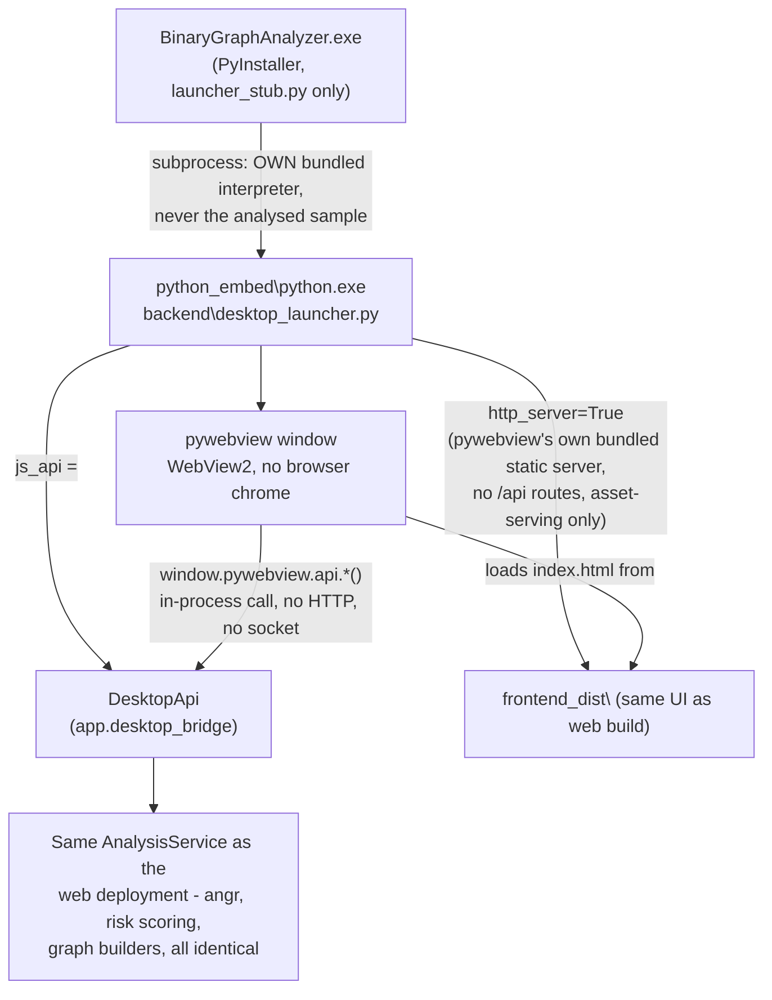

# Desktop build

Packages Binary Graph Analyzer as a standalone Windows program: one folder,
one `.exe`, nothing else required on the machine that runs it — no Python, no
Node.js, no `pip`/`npm`, no internet access at run time.

> Same safety guarantees as the web deployment: the sample is only ever read
> and disassembled by angr, never executed. See the root
> [README's safety section](../README.md#10-lưu-ý-an-toàn) — everything there
> applies here unchanged.

## What you get

```
BinaryGraphAnalyzer/
├── BinaryGraphAnalyzer.exe   <- double-click this (~9 MB native launcher)
├── python_embed/             <- portable Python 3.14 + angr + everything else
├── backend/                  <- app/ source + desktop_launcher.py
└── frontend_dist/            <- built frontend (same UI as the web version)
```

Copy the whole `BinaryGraphAnalyzer\` folder to any Windows 10/11 x64 machine
(USB drive, network share, cloud sync — whatever) and run the `.exe`. It opens
a native window (WebView2 — bundled with Windows since 2021, nothing to
install) showing the same interface as `npm run dev` / the hosted web build.
**No HTTP server runs for the API**: the window's JavaScript calls straight
into the bundled Python via pywebview's `js_api` bridge
(`window.pywebview.api.*`), not `fetch()`/REST — see "Architecture" below.

The folder is large (**~600 MB**, mostly angr's compiled dependencies —
z3-solver, capstone, pyvex). That is the deliberate trade-off of "runs on any
Windows machine, zero install": everything angr needs ships in the box.

**Prefer copying the folder over `-Zip`.** Most of this tree is
already-compressed binaries and thousands of small files, which is close to
the worst case for zip tooling - both `Compress-Archive` and .NET's
`ZipFile` API were measured taking many minutes (tens of minutes,
extrapolated) without shrinking the payload much. Robocopy, a USB drive, or a
network share all move the folder as-is far faster than zip-then-unzip does.
`-Zip` is there for when a single-file artifact is genuinely required (e.g.
an upload form that only accepts one file), not as the default handoff path.

## Building it

Prerequisites: the normal backend/frontend dev setup
([root README, sections 4–5](../README.md)) plus internet access (to fetch
the embeddable Python distribution and PyPI wheels the first time).

```powershell
cd scripts
powershell -ExecutionPolicy Bypass -File build_desktop_app.ps1
```

Output lands in `dist_desktop\BinaryGraphAnalyzer\` at the repo root. Add
`-Zip` for an archive alongside it, or `-SkipDownload` to reuse a
previously-fetched embeddable Python / `get-pip.py` from `desktop\.cache\`
(faster rebuilds after a code-only change).

First build: ~10–15 minutes (downloading and pip-installing angr's full
dependency tree into the embeddable Python). Rebuilds with `-SkipDownload`
after only touching `app/` or the frontend are much faster — the slow part is
pip-installing dependencies, which is skipped entirely if `python_embed/`
already has them (delete `dist_desktop/` to force a clean rebuild).

## Architecture



The only local server in the desktop build is pywebview's own bundled static
file server (`webview.start(http_server=True)`), used solely because Chromium
blocks ES module `<script>` tags — what a Vite build emits — from loading over
a bare `file://` URL. It has no `/api/*` routes, never touches the analysed
sample, and is not `app.main` (the FastAPI app used by the web deployment,
which this build never imports). Every actual analysis operation — upload,
call graph, CFG, decompile, export — is a same-process Python method call
through `js_api`, not a network request.

### Why an embeddable Python instead of freezing everything with PyInstaller

angr's plugin/SimProcedure system does a lot of dynamic, introspection-based
importing that PyInstaller's static import analysis does not reliably
discover — a well-known source of "works from source, breaks when frozen"
bugs specifically for angr-based tools. This build keeps angr on a real,
unfrozen interpreter (the official Python **embeddable distribution**, with a
completely normal `site-packages` populated by plain `pip install`) and only
ever PyInstaller-freezes `launcher_stub.py` — a ~30-line script with no
dynamic imports of its own, which PyInstaller handles reliably.

Verified concretely during development (not assumed): capstone and
claripy/z3 — the two heaviest compiled dependencies — both import and run
correctly from the embeddable distribution, and a full `CFGFast` analysis of
a real PE succeeds end to end from the packaged bundle.

### Two gotchas specific to the embeddable distribution

Both bit us during development and are worth knowing if you touch
`build_desktop_app.ps1`:

1. **`._pth` file BOM.** PowerShell 5.1's `Set-Content -Encoding utf8` writes
   a UTF-8 byte-order mark. Python's `._pth` parser does not strip it, so a
   BOM glued onto the first line (the bundled stdlib zip's filename) makes
   the interpreter unable to find its own standard library —
   `Fatal Python error: Failed to import encodings module`, before a single
   line of app code runs. The script writes this file with
   `[System.IO.File]::WriteAllText(..., [System.Text.Encoding]::ASCII)`
   instead, which never emits a BOM.

2. **No auto `sys.path` for the running script.** A normal Python install
   auto-prepends the directory of the script you run (`python foo.py`) to
   `sys.path`. The embeddable distribution's `._pth` file takes full control
   of `sys.path` and does *not* do this — and it ignores `PYTHONPATH` too.
   `desktop_launcher.py` handles this itself
   (`sys.path.insert(0, ...its own directory...)`) before importing `app`, so
   it works regardless of how or where it's launched from.

## Known limitations

- **Windows only.** Relies on WebView2 (Windows-bundled Edge runtime) and the
  Windows-specific embeddable Python distribution.
- **First launch is the slowest.** Windows Defender (or another AV) typically
  scans newly-written `.pyd`/`.dll` files the first time each is touched;
  measured during development, `angr.Project()` construction dropped from
  ~13s (first run) to ~0.5s (second run) purely from that. Subsequent
  launches on the same machine are fast.
- **No custom icon yet.** `BinaryGraphAnalyzer.exe` uses PyInstaller's
  default icon. Cosmetic only — pass `--icon path\to\icon.ico` to the
  PyInstaller invocation in `build_desktop_app.ps1` if you have one.
- **Console window.** The launcher exe is built `--console` (not
  `--windowed`) so startup errors are visible rather than silently
  swallowed. Switch to `--windowed` in `build_desktop_app.ps1` once you're
  confident errors won't need to be seen — the backend already logs to
  `backend`'s own logger regardless.
